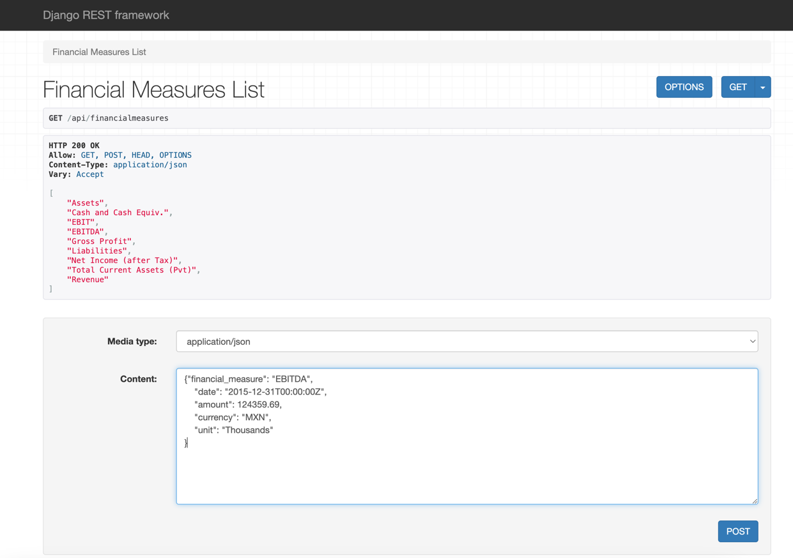
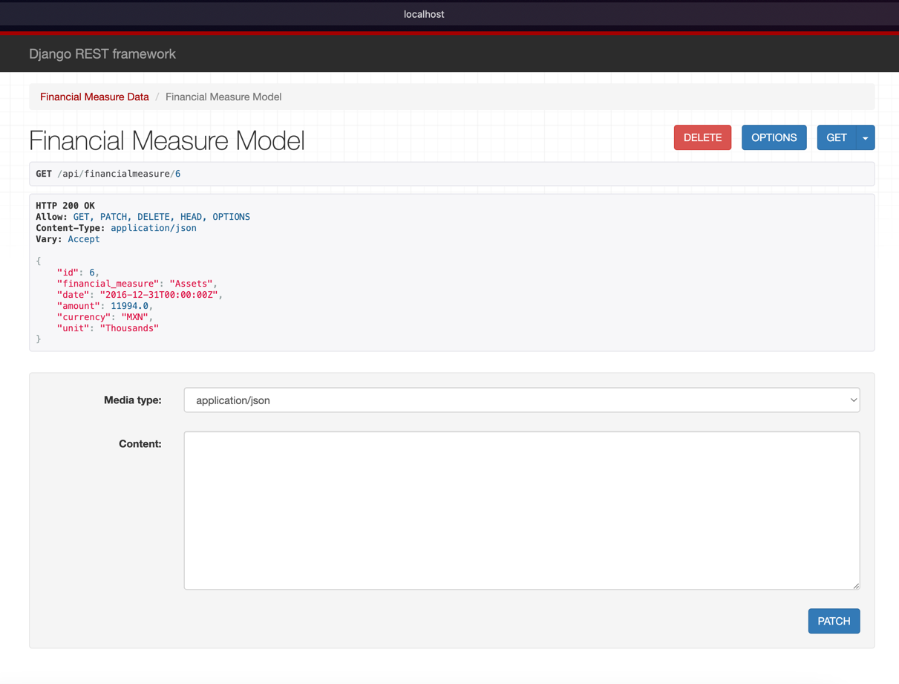

# alpas-coding-challenge

This repo is a technical assessment proposed by Alpas.

The assessment is solved in [financial_project](financial_project), it is intended to be a proof of the skills of David
Zumaquero (Me) in python programming language in a short period of time.

You can find a description of the assessment proposed by Alpas
in [challenge description](financial_project/docs/Python Engineer Coding Challenge.pdf)

## Financial Project

The aim of this project is to build a data model embedded in a database and an API to perform CRUD operations using the
financial data provided.

### Set up

Pre requirements: You will need to have Docker installed, if not please
download [here](https://www.docker.com/products/docker-desktop/) and install it.

First, we want build the docker compose image. You can see the file to make this build [here](docker-compose.yml).  
For this we move to the path that we have the [conding_challenge folder](./) (in our console/terminal/bash).

```cd path_to_alpas-coding-challenge```

After that, we can build the docker image. Remember to have your docker app (docker daemon) running.

```bash 
docker-compose build
```

We can use docker-compose up; it will create to docker containers, one for the API and one for the database.

```bash
docker-compose up -d
```

Once our containers are running you can create the table in our database with the following  command:

```bash
docker-compose run web python manage.py migrate
```

After that, you can fill the database with the provided data or any data with the same json structure.

```bash
docker-compose run web python manage.py load_financial_data data/financial_data.json
```

Now, you have your API ready.

### Usage

To use this API you just have to make request with CRUD methods to one of the following urls:

http://localhost:8000/api/financialmeasures

http://localhost:8000/api/financialmeasure?financial_measure={financial_measure_name}

http://localhost:8000/api/financialmeasure/{record_number}

You can make the request [Postman](https://www.postman.com/), [Insomnia](https://insomnia.rest/) or simply using the above urls in your browser.

### Example

We are going to give you and example of usage using the browser.

First we are going to see the different finance measures we have and how we
can create a new record in the database: http://localhost:8000/api/financialmeasures



Now, let's see data with financial measure = Assets: http://localhost:8000/api/financialmeasure?financial_measure=Assets


Finally, we can see, update and delete a record in the database: http://localhost:8000/api/financialmeasure/6




Enjoy it!

Please, see [technical notes](financial_project/docs/technical_notes.md) to know more about the technical part of the project.

